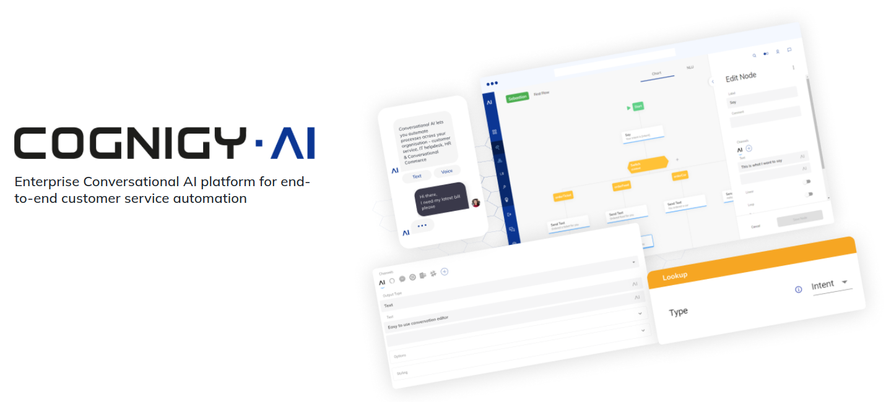

# Cognigy.AI Helm Chart
[Cognigy.AI](https://www.cognigy.com/) in an Enterprise Conversational Automation Platform for building advanced, integrated Conversational Automation Solutions through the use of cognitive bots.

This chart installs a Cognigy.AI deployment on a [Kubernetes](https://kubernetes.io/) cluster using the [Helm](https://helm.sh/) package manager.

## Prerequisites
1. A kubernetes cluster configured according to [Prerequisites](https://docs.cognigy.com/ai/installation/prerequisites/).
2. Kubernetes, kubectl and Helm versions are compatible with Cognigy.AI as specified in [Version Compatibility Matrix](https://docs.cognigy.com/ai/installation/version-compatibility-matrix/).
3. `kubectl` and `helm` utilities connected to the Kubernetes cluster in administrative mode.


## Dependencies
1. Create a MongoDB deployment with Cognigy's MongoDB Helm Chart:
   1. MongoDB Deployment must be created in `mongodb` namespace
   2. Deployment must have 3 replicas
   3. Note down `rootUser` and `rootPassword` from the MongoDB Helm release, you will need to set them later in Cognigy.AI configuration.
2. _(AWS only)_: Create two [EFS volumes](https://docs.aws.amazon.com/AmazonECS/latest/developerguide/efs-volumes.html) for `functions` and `flow-modules` PVCs. Note down their `File system ID` values. **IMPORTANT:** EFS volumes must be reachable from a VPC in which your EKS cluster is running!
3. For generic (GKE on GCP or on-premises) cloud providers you need to prepare following objects for stateful services manually:
   1. `flow-modules` and `functions` file storage PVCs in `cognigy-ai` namespace (the same namespace where Cognigy.AI will be deployed) with:
      - `accessModes`: `ReadWriteMany`
      - `requests.storage: 100Gi`
   Provisioning of such PVCs depends on [Storage Class Provisioners](https://kubernetes.io/docs/concepts/storage/storage-classes/#provisioner) with `ReadWriteMany` access mode supported by your underlying infrastructure (typically NFS). Please, contact official documentation of your cloud provider for that.
   2. `redis-persistent-ha` `StorageClass` for `redis-persistent-ha` PVCs. See [values.yaml](values.yaml) as a reference for AWS or Azure. The storage class must support equal performance parameters in terms of IOPS and bandwidth.

## Configuration
To deploy a new Cognigy.AI setup you need to create a separate file with Helm release values. You can use `values_prod.yaml` as a baseline, we recommend to start with it:
1. Make a copy of `values_prod.yaml` into a new file and name it accordingly, we refer to it as `YOUR_VALUES_FILE.yaml` later in this document. 
2. **Do not make** a copy of default `values.yaml` file as it contains hardcoded docker images references for all microservices, and in this case you will need to change all of them manually during upgrades. However, you can add some variables from default `values.yaml` file into your customized `YOUR_VALUES_FILE.yaml` later on, e.g. for tweaking CPU/RAM resources of Cognigy.AI microservices. We describe this process later in the document.

### Setting Essential Parameters
You need to set at least following parameters in `YOUR_VALUES_FILE.yaml`:
1. Cognigy.AI Image repository credentials: set `imageCredentials.username` and `imageCredentials.password` accordingly.
2. Cloud Provider and Region: set `cloud.provider` and `cloud.region` variables accordingly. You do not need to set `cloud.region` for `generic` cloud provider.
3. MongoDB root credentials: set `mongodb.auth` `username` and `password` to `rootUser` and `rootPassword` values of MongoDB helm release created before.
4. **AWS only**: EFS system IDs: set `flowModules.id` and `functions.id` in `efs` section according to `File system ID` values created previously.
5. Management UI: if you are going to use Management UI component:
   1. create `username` and `password` for Management UI interface in `managementUiCredentials` variable.
   2. follow the section [Install Management-UI](#install-management-ui) below

### Cognigy.AI DNS and TLS Settings
Cognigy.AI exposes several web services for which you will need to assign DNS records in a public domain operated by your organization. These DNS records must be added into your DNS system before you continue with the installation process. Replace `yourdomain.com` according to the domain (subdomain) of your organization under `ingress` section as below:
```yaml
ingress:
  serviceAnalyticsOdata:
    host: "odata-yourdomain.com"
  serviceApi:
    host: "api-yourdomain.com"
  serviceAppSessionManager:
    host: "apps-yourdomain.com"
  serviceEndpoint:
    host: "endpoint-yourdomain.com"
  serviceInsightsApi:
    host: "insights-api-yourdomain.com"
  serviceRuntimeFileManager:
    host: "files-api-yourdomain.com"
  serviceStaticFiles:
    host: "static-api-yourdomain.com"
  serviceUi:
    host: "yourdomain.com"
  serviceWebchat:
    host: "webchat-yourdomain.com"
```
Cognigy.AI relies on SSL-encrypted connection between the client and the services You need to provide an SSL certificate for the domain in which DNS records for Cognigy.AI will be created, for this put the SSL certificate under `tls.crt` and its private key under `tls.key`. If you have a certificate chain, make sure you provide the whole certificate chain under `tls.crt` in [.pem format](https://www.digicert.com/kb/ssl-support/pem-ssl-creation.htm). 

**Note: Make sure you install a publicly trusted TLS certificate signed by a Certificate Authority. Although using of self-signed certificates is possible in test environments, Cognigy does not recommend usage of self-signed certificates, does not guarantee full compatibility with our products and will not support such installations.**

### Installing the Chart
1. Download chart dependencies:
```bash
helm dependency update
```
2. Install Cognigy.AI Helm release: 
* Installing from Cognigy Container Registry (recommended), specify proper `HELM_CHART_VERSION` and `YOUR_VALUES_FILE.yaml`:
   * Login into Cognigy helm registry (provide your Cognigy Container Registry credentials):
   ```bash
   helm registry login cognigy.azurecr.io \
   --username <your-username> \
   --password <your-password>
   ```
   * Install Helm Chart into a separate `cognigy-ai` namespace:
   ```bash
   helm upgrade --install --namespace cognigy-ai cognigy-ai oci://cognigy.azurecr.io/helm/cognigy.ai --version HELM_CHART_VERSION --values YOUR_VALUES_FILE.yaml --create-namespace
   ```
* Alternatively you can install it from the local chart (not recommended):
   ```bash
   helm upgrade --install --namespace cognigy-ai --values YOUR_VALUES_FILE.yaml cognigy-ai .
   ```

3. Verify that all pods are in a ready state:
```bash
kubectl get pods --namespace cognigy-ai
```
Proceed with logging in into Cognigy.AI and provide license according to official installation documentation.

### Upgrading Helm Release
To upgrade Cognigy.AI platform to a newer version, you need to upgrade the existing Helm release to a particular `HELM_CHART_VERSION`, for this execute:
```bash
helm upgrade --namespace cognigy-ai cognigy-ai oci://cognigy.azurecr.io/helm/cognigy.ai --version HELM_CHART_VERSION --values YOUR_VALUES_FILE.yaml
```

### Install Management-UI
Cognigy Management UI is a lightweight companion product which allows our customers to manage their Cognigy.AI v4 systems. It allows our customers to create new organizations, create users, inspect billing relevant information and perform other maintenance and configuration operations like configuring the password-policy. Please note that you need to have a fully working Cognigy.AI setup in order to use the Cognigy Management UI.

If you want to install Management UI, you need to enable it in `YOUR_VALUES_FILE.yaml` file. An example is shown below:

```yaml
managementUi:
  enabled: true # `true` to install Management UI
  ingress:
    enabled: true # `true` to create an Ingress for Management UI
    host: "management-ui.yourdomain.com" # `host` value for the Management UI Ingress
```
Then update the Helm release:
```bash
helm upgrade --namespace cognigy-ai cognigy-ai oci://cognigy.azurecr.io/helm/cognigy.ai --version HELM_CHART_VERSION --values YOUR_VALUES_FILE.yaml
```

### Modifying Resources
Default resources for Cognigy.AI microservices specified in `values.yaml` are tailored to provide consistent performance for typical production use-cases. However, to meet particular demands, you can modify RAM/CPU resources or number of replicas for separate microservices in your Cognigy.AI installation. For this you need to copy specific variables from default `values.yaml` into `YOUR_VALUES_FILE.yaml` for a particular microservice and adjust the `Request/Limits` and `replicaCount` values accordingly.

**IMPORTANT:** Do not copy `image` value as you will need to modify it manually during upgrades!

For example, for `service-ai` microservice copy from `values.yaml` and adjust in `YOUR_VALUES_FILE.yaml` following variables:
```yaml
serviceAi:
  replicaCount: 1
  resources:
    requests:
      cpu: '0.4'
      memory: 400M
    limits:
      cpu: '0.4'
      memory: 500M
```

### NLP Configuration
We recommend to install NLPv2 stack, NLPv1 stack is deprecated. 
See [Install the NLP V2 Stack](https://docs.cognigy.com/ai/installation/migration/from-nlu-v1-to-v2-migration/#install-the-nlp-v2-stack) for details and an example in `values_prod.yaml` files.

### Cognigy.AI Secrets Backup
During the installation process `dbinit-generate.sh` initialization script generates connection strings for Cognigy.AI microservices to MongoDB, RabbitMQ and Redis backends and stores these connection strings in form of [Kubernetes secrets](https://kubernetes.io/docs/concepts/configuration/secret/) in `cognigy-ai` installation namespace. In case you loose the cluster where Cognigy.AI is running or accidentally delete these secrets, there will be no possibility to connect to the existing databases anymore. 

**Thus, it is crucial to make a consistent backup of the secrets in `cognigy-ai` namespace and to store them securely**. Execute this [script](scripts/backup_cognigy_ai_secrets.sh) to perform a backup of secrets. Set `LIVE_AGENT_ENABLED=true` in case Live Agent product is installed alongside with Cognigy.AI. Store the folder with the secrets securely as it contains sensitive data.

### Uninstalling the Release
**IMPORTANT:** If you uninstall the Cognigy.AI Helm release, `traefik` Ingress deployment will also be removed. Consequently, a dynamically provisioned `External IP` of the cloud provider's load balancer (e.g. ELB on AWS) will also be freed up. It will affect static DNS settings configured during DNS setup and will cause a downtime of your installation. If you recreate a release you will also have to update DNS, make sure DNS timeouts are set properly, to avoid long outages.

To uninstall a release execute:
```bash
helm uninstall --namespace cognigy-ai cognigy-ai
```

### Clean-up
Please keep in mind that Persistent Volume Claims (PVC) and Secrets are not removed when you delete the Helm release. However, please also keep in mind that:

- Some Secrets contain the MongoDB credentials, so if they are gone, the services cannot access MongoDB anymore
- All data will be lost if PVCs are cleaned up

To fully remove PVCs and secrets you need to run the following command:

**IMPORTANT: If you run these commands, all data persisted in PVCs will be lost!**

**IMPORTANT: If you run these commands, all MongoDB credentials will be lost!**
```bash
kubectl delete --namespace cognigy-ai pvc --all
kubectl delete --namespace cognigy-ai secrets --all
```
